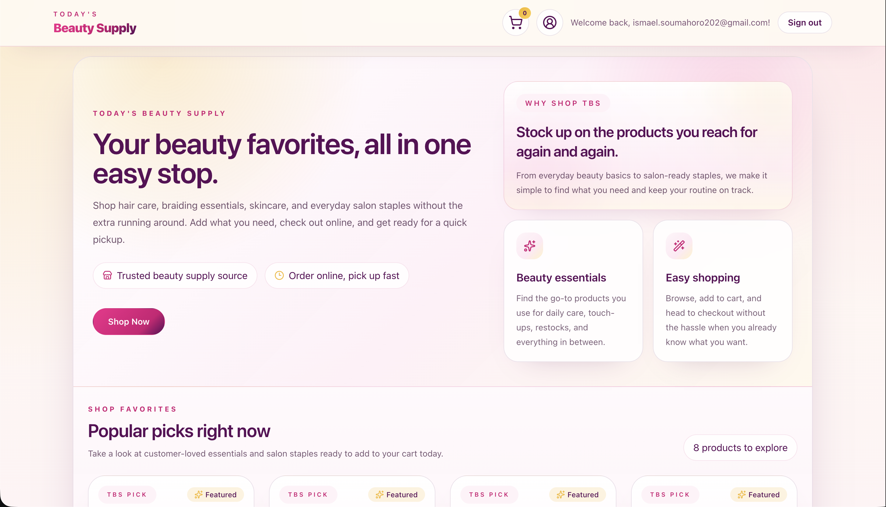
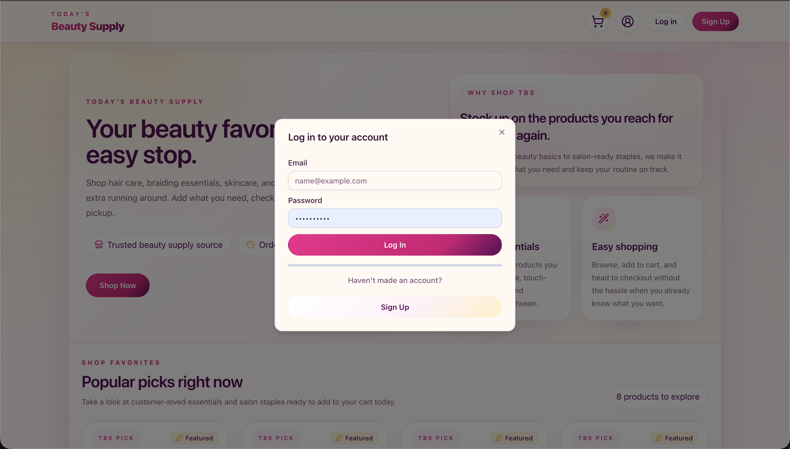
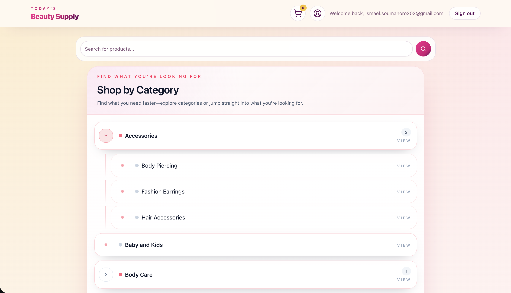
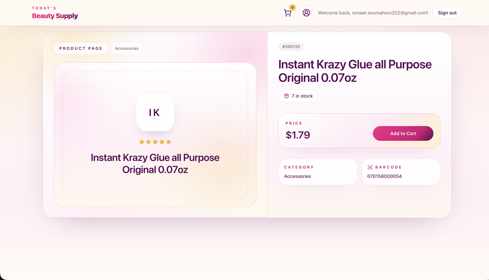
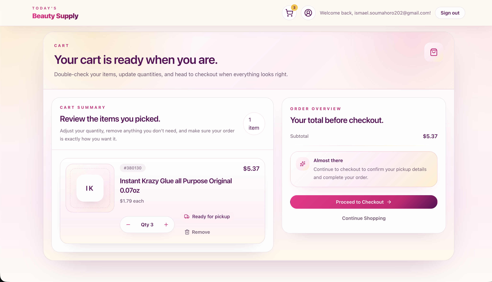
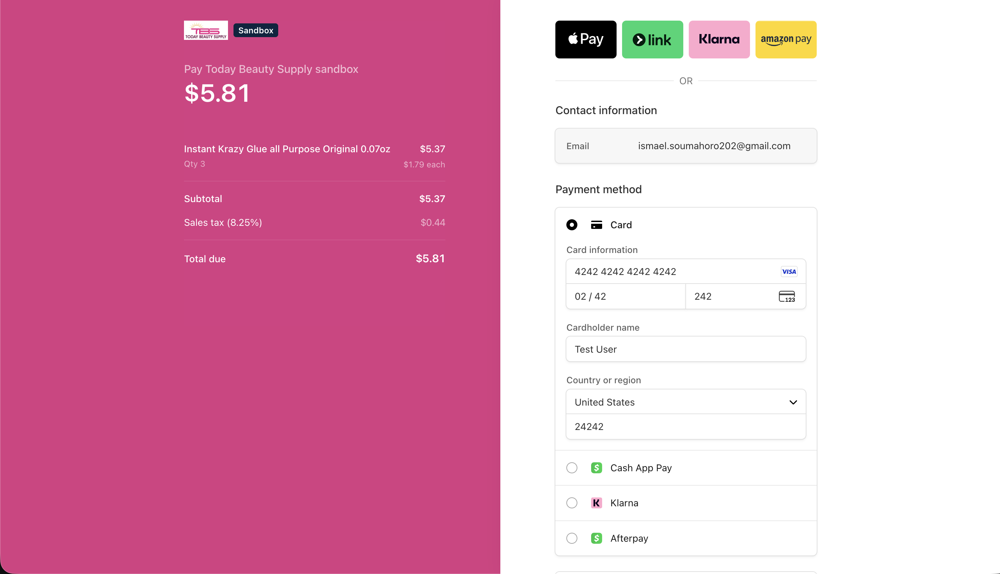

# E-Commerce Website

A full-stack e-commerce prototype built for Today Beauty Supply to evaluate whether a custom in-house storefront could support the business’s transition into online retail.

The application implements a database-backed product catalog, product detail pages, cart management, inventory visibility, SKU/barcode metadata, and a Stripe Checkout flow. It was built with Next.js, TypeScript, Supabase/PostgreSQL, Stripe, Tailwind CSS, and deployed on Vercel.

The prototype was ultimately used as a business and technical validation exercise. After comparing the custom build against Shopify, the business chose Shopify for production because of its built-in payment handling, admin tooling, operational maturity, extensibility, and faster time-to-market for a nontechnical retail team.

Live Demo: [https://tbs-ecomm-prototyping-store-front.vercel.app/](https://tbs-ecomm-prototyping-store-front.vercel.app/)

### Features

- product catalog
- product detail pages
- cart flow
- inventory/stock visibility
- SKU/barcode metadata
- Vercel deployment

## Images

### Storefront Landing Page

A pickup-oriented storefront experience for browsing beauty supply essentials.

### Authentication Flow

User login and signup modals for account-based shopping.

### Category Browsing

Hierarchical category navigation for organizing beauty supply inventory.

### Product Detail Page

Product detail view [^1] with pricing, stock count, category, and barcode metadata.

[^1]: Product images are represented with generated placeholders in the prototype while the business prepares a separate production catalog and photography workflow.

### Cart Management

Cart summary with quantity updates, item removal, subtotal calculation, and checkout entry point.

### Stripe Checkout

Stripe Checkout integration in sandbox mode for validating the payment flow.

## Tech Stack

1. Database: Supabase
2. Frontend: React.js/Next.js
3. Languages: Typescript and PostgreSQL
4. UI/UX: shadcn components
5. Styling: Tailwind
6. Payment API: Stripe

I decided to keep the stack as barebones as possible.
Supabase does a tremendous job at being a complete
backend. After doing an intensive, 2 week long deep dive
into the PSQL Database Management System and PostgreSQL,
I was able to leverage Postgres' flexibility
to a much higher degree after studying those basics,
rather then having to rely on the useful,
but often non sufficient supabase queries.
I was able to create views, indexes, and use psql
to interact with the database directly instead of
relying on supabase's GUI and AI assistant. I wrote my own
database procedures and used them though supabase's
rpc implementation.

For the frontend, I chose Next.js due to
my experience with React and the added benefit of SSR of
products for SEO reasons. I used shadcn/ui components
throughout the entire project because I truly dislike
debugging UI and why reinvent the wheel? I also had Codex generate
most of the UI and styling, as my main goal is experience building
backend systems, and being more of a generalist, full-stack engineer.

## Repository Structure

I decided on a monorepo, with the application split into 6 seperate packages,
all found at the `package/` directory
generally corresponding with the layers of Clean Architecture,
as described by Uncle Bob in his book with the same name.

### **Enterprise Business Rules (Entities & Repositories)**

These are found in `@tbs/core` package, located at the `core/` directory.
Here you can find business entities and rules, alongside the necessary interfaces
required for data access in the repositories.

### **Application Business Rules (Use Cases)**

You can find use cases in the client facing packages,
`internal-dashboard` and `store-front` (each located in the directory sharing the same name.)
Currently, only use cases of the store-front have been implemented.

### **Interface Adapters (Gateways, Controllers, and Presenters)**

The interface adapters are found in the `@tbs/adapters` package, located at the `adapters/` directories.

### **Frameworks and Drivers**

The frameworks and drivers of the project are found in a few different places. The UI is found in `internal-dashboard` and `store-front`.
Mappers and types used for UI state are found in `@tbs/view-models`, the `view-models/` directory.

### Note:

(As of 6/27/2026) Not the entirety of this project was implemented following Clean Architecture. I had decided a few months in that it would make sense
to start to refactor the code into such an architecture to have a clean seperation of concerns before the complexity layered on, the goal
is to implement clean architecture entirely.

## Did I Use AI?

When I started the project, I kept my use of AI to a minimum.
I used it mainly for debugging and ideation. There was a point where I used Codex early on, but I realized that it would've handicapped my learning as an inexperienced developer, and the code produced was well beyond
the scope of which I've written before, so I decided to not move on with it after the first pull request.

From that point forward I had commited to writing code myself, only relying on AI as a debugging assistant, an intuition aid, and a tutor/reference when working with new technology or tech with terrible documentation.

I did end up using it heavily for frontend design. I don't care much to specialize in it, and simply understanding the basics and different components utilized in frontend is enough for me.
I didn't want to spend 30 minutes perfecting a gradient or color palettes.
